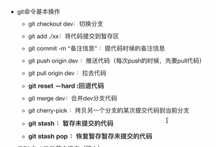

# 7月

## 1.1抽象类

不可以被实例化，但可以有构造函数，它的构造函数会在子类实例化的时候调用。


   - 抽象类的特点：
     + 抽象类不能实例化
     + 抽象类不一定包含抽象方法，但是一个类包含抽象方法，它就一定是抽象类。
     + 抽象类中的抽象方法只是声明，不包含方法体。
     + 继承抽象类的子类如果不是抽象类就必须重写父类的所有抽象方法。
     + 构造方法，类方法（用 static 修饰的方法）不能声明为抽象方法。

## 1.2[泛型的使用](https://www.cnblogs.com/jpfss/p/9928747.html)：

## 1.3[next()和nextLine()的区别](https://blog.csdn.net/LeeeeC/article/details/99655436)

next和nextline方法的区别在于nextLine会接收空格字符（包含空格和Tab键，下同），而next不会

next会去除输入前面和后面的回车字符，只截取有效字符。如果next在前面那就在二者间加一个next Line()吃掉一个换行,防止nextline无效。


   > 

如何在循环输入时，跳出while循环

```java
 while(!sc.hasNext("#")){
            int a = sc.nextInt();
            list.add(a);
        }
```


## 1.4正则表达式

```java
*:零次或多次匹配前面的字符或子表达式。例如，zo* 匹配"z"和"zoo"。* 等效于 {0,}。
?:零次或一次匹配前面的字符或子表达式。例如，"do(es)?"匹配"do"或"does"中的"do"。? 等效于 {0,1}。
当此字符紧随任何其他限定符（*、+、?、{n}、{n,}、{n,m}）之后时，匹配模式是"非贪心的"。"非贪心的"模式匹配搜索到的、尽可能短的字符串，而默认的"贪心的"模式匹配搜索到的、尽可能长的字符串。例如，在字符串"oooo"中，"o+?"只匹配单个"o"，而"o+"匹配所有"o"。
```

## 1.4count(*)和count(1)的区别

count(1) and count(*)两者的主要区别是：

1、执行效果上：

count(1)，其实就是计算一共有多少符合条件的行。

1并不是表示第一个字段，而是表示一个固定值。

其实就可以想成表中有这么一个字段，这个字段就是固定值1，count(1)，就是计算一共有多少个1。count(*)，执行时会把星号翻译成字段的具体名字，效果也是一样的，不过多了一个翻译的动作，比固定值的方式效率稍微低一些。

2、执行效率上：

他们之间根据不同情况会有些许区别，MySQL 会对count(*)做优化。(1)如果表中只有一列，则count(* )效率最优。(2)如果表有多列，且存在主键，count (主键列名)效率最优，其次是：count (1) >count( *)。(3)如果表有多列，且不存在主键，则count(1 )效率优于count( *)

3、从执行结果来说：

1、count(1)和count (*)之间没有区别，因为count (*) count (1)都不会去过滤

2、(排除)空值，但count (列名)就有区别了，因为count (列名)会过滤空值。

```
git push -u origin master 上面命令将本地的master分支推送到origin主机，同时指定origin为默认主机，后面就可以不加任何参数使用git push了
```

3、"pageSize": 10,

​      "pageNum": 1

4、单个功能服务调用，是写成两个接口返回数据让前端匹配，还是后端内嵌模块调用并封装好

---

# 8月

## 1.1final

不是所有的 final 修饰的字段都是编译期常量，只是 k 的值在被初始化后无法被更改

````java
public class Test {
    public static void main(String[] args)  {
        String a = "hello2"; 
        final String b = "hello";
        String d = "hello";
        String c = b + 2; 
        String e = d + 2;
        System.out.println((a == c));  // ture
        System.out.println((a == e)); // false
    }
}
````

## 1.2常用注解

@Log4j/@Slf4j ： 注在类上，提供对应的 Logger 对象，变量名为 log
@JsonInclude(JsonInclude.Include.NON_NULL)：用来去除数据中的空值
@ToString(callSuper = true) 注解,在用 log 打印时才会打印父类属性
@EqualsAndHashCode(callSuper = true)该注解用于子类对象之间进行比较的时候，不加该注解的影响：子类对象属性值一致，但其继承的父类对象属性值不一致，在比较的时候会出现比较结果不对的情况


## 1.3String

```java
1、
String str1 = "a";
String str2 = "b";
String str3 = "ab";
String str4 = str1 + str2;
String str5 = "a" + "b";
System.out.println(str3 == str4);//false
System.out.println(str3 == str5);//true

问题：为什么str3和str4的地址不同？按理来说都是在字符串池中的对象

String str5 = “a” + “b”; 当字符串相加的部分中全部都是常量时，那么就会直接进入字符串池中进行操作，所以我们生成的str5对象地址就在字符串池中
String str4 = str1 + str2;当字符串相加部分中有变量，那么就会用StringBulider的方式来添加，那么返回的地址就是堆中的地址！
一个在堆中，一个在字符串池中，当然会是false

 2、
    String st1 = new String(“abc”);
在内存中创建两个对象，一个在堆内存，一个在常量池，堆内存对象是常量池对象的一个拷贝副本
       package string;
```


      public static void main(String[] args) {
        String st1 = "ab";
        String st2 = "abc";
        String st3 = st1 + "c";
        System.out.println(st2 == st3);  //false
        System.out.println(st2.equals(st3));//true
      }

   我们知道任何数据和字符串进行加号（+）运算，最终得到是一个拼接的新的字符串。上面注释说明了这个拼接的原理是由StringBuilder或者StringBuffer类和里面的append方法实现拼接，然后调用toString（）把拼接的对象转换成字符串对象，最后把得到字符串对象的地址赋值给变量.


    4、final String a="hello";             

   String b="hello";
   String c="hellow";
   String d=new String("hello"); 
   System.out.println(a==b);   true
   System.out.println("hell"+"ow"==c); true
   System.out.println((a+"w")==c);  true
   System.out.println((b+"w")==c);  false
   System.out.println(b==d);   false
       对于修饰变量的final关键字可以理解为C语言中的const关键字，表明了变量是一个常量。对于String类的底层实现，和C++中的类似，也可以理解为对const char的封装。因此a,b,c的初始化都是将常量区中字符串的地址赋值给变量，不同的是对于变量a的理解为：typedef const char String; const String a="hello";即a指向地址不能变并且地址保存内容不能变。而d变量保存的则是通过new操作得到的堆上的地址，然后会把常量区字符串给拷贝到堆上的地址空间。java中对于final修饰的变量，在编译前直接把变量替换为值，类似于宏，因此a+"w"会替换为"hello"+"w",对于这一个操作，java会直接在常量区中找"hellow"，如果没找到，就会在常量区创建一个"hellow"，这一点可以从"hell"+"ow"c为true得到验证。而对于b变量没有被final修饰，所以b+"w"的操作，应该是String类型重载的+操作，这是在编译后执行的，由于String底层是const char*,所以应该会重新在堆上开辟空间后将地址赋值给b。上面这些比较的都是地址值，所以会出现上述执行结果   


2. [final变量和普通变量的区别](https://www.cnblogs.com/dolphin0520/p/3736238.html)

   ```java
    public class Test {
       public static void main(String[] args)  {
           String a = "hello2"; 
           final String b = "hello";
           String d = "hello";
           String c = b + 2; 
           String e = d + 2;
           System.out.println((a == c));
           System.out.println((a == e));
       }
   }
   ```

   ​    当final变量是基本数据类型以及String类型时，如果在编译期间能知道它的确切值，则编译器会把它当做编译期常量使用。也就是说在用到该final变量的地方，相当于直接访问的这个常量，不需要在运行时确定。这种和C语言中的宏替换有点像。因此在上面的一段代码中，由于变量b被final修饰，因此会被当做编译器常量，所以在使用到b的地方会直接将变量b 替换为它的  值。而对于变量d的访问却需要在运行时通过链接来进行。想必其中的区别大家应该明白了，不过要注意，只有在编译期间能确切知道final变量值的情况下，编译器才会进行这样的优化

## 1.4Java中final和static

修饰的变量是在什么时候赋值的？

深入Java虚拟机有一句是ConstantValue属性的作用是通知虚拟机自动为静态变量赋值，只有被static关键字修饰的变量才可以使用这项属性。但为什么private final a = 10也可以被赋值？

tip:https://blog.csdn.net/itcodexy/article/details/112793206?utm_medium=distribute.pc_relevant.none-task-blog-2~default~baidujs_baidulandingword~default-0-112793206-blog-100159485.pc_relevant_default&spm=1001.2101.3001.4242.1&utm_relevant_index=3

final和static

static作用于成员变量用来表示只保存一份副本，而final的作用是用来保证变量不可变

```java
public class Test {
    public static void main(String[] args)  {
        MyClass myClass1 = new MyClass();
        MyClass myClass2 = new MyClass();
        System.out.println(myClass1.i);
        System.out.println(myClass1.j);
        System.out.println(myClass2.i);
        System.out.println(myClass2.j);

    }
}

class MyClass {
    public final double i = Math.random();
    public static double j = Math.random();
}
// i不同，j相同
```

## 1.5String底层


tip:[ava final关键字和String常量 不可变的理解](https://blog.csdn.net/weililansehudiefei/article/details/71218789)

[Java中final修饰的字符串和常量池之间的联系](https://blog.csdn.net/weixin_43194122/article/details/88894818)

---

## 1.6 反射

1、**反射**：是为了解决在运行期，对某个实例一无所知的情况下，如何调用其方法

2、如何获取一个`class`的`Class`实例？有三个方法

https://www.liaoxuefeng.com/wiki/1252599548343744/1264799402020448

```java
1、直接通过一个class的静态变量class获取：
Class cls = String.class;


2、
String s = "Hello";
Class cls = s.getClass();


3、方法三：如果知道一个class的完整类名，可以通过静态方法Class.forName()获取：
Class cls = Class.forName("java.lang.String");


tip:
Integer n = new Integer(123);

boolean b1 = n instanceof Integer; // true，因为n是Integer类型
boolean b2 = n instanceof Number; // true，因为n是Number类型的子类

boolean b3 = n.getClass() == Integer.class; // true，因为n.getClass()返回Integer.class
boolean b4 = n.getClass() == Number.class; // false，因为Integer.class!=Number.class
```

---

# 9月

## 1.1**DTO参数校验问题**

```
@Valid：没有分组的功能。

@Valid：可以用在方法、构造函数、方法参数和成员属性（字段）上

@Validated：提供了一个分组功能，可以在入参验证时，根据不同的分组采用不同的验证机制

@Validated：可以用在类型、方法和方法参数上。但是不能用在成员属性（字段）上

两者是否能用于成员属性（字段）上直接影响能否提供嵌套验证的功能
```

---

## 1.2 双亲委派

1. **jvm双亲委派**：向上委派（if缓存），向下查找

tip:[外部参考](https://blog.csdn.net/m0_50370837/article/details/121226022?spm=1001.2101.3001.6650.15&utm_medium=distribute.pc_relevant.none-task-blog-2%7Edefault%7EBlogCommendFromBaidu%7ERate-15-121226022-blog-121345330.pc_relevant_multi_platform_whitelistv4&depth_1-utm_source=distribute.pc_relevant.none-task-blog-2%7Edefault%7EBlogCommendFromBaidu%7ERate-15-121226022-blog-121345330.pc_relevant_multi_platform_whitelistv4&utm_relevant_index=18)

2. **Class<?> tcClass的方法**  -----反射

- getField 只能获取public的，包括从父类继承来的字段。
- getDeclaredField 可以获取本类所有的字段，包括private的，但是不能获取继承来的字段。 (注： 这里只能获取到private的字段，但并不能访问该private字段的值,除非加上setAccessible(true))

---

## 1.3自动装箱与拆箱

```
Integer i = 10;  //装箱
int n = i;   //拆箱
```


## 1.4[为什么重写equals必须重写hashCode](https://segmentfault.com/a/1190000024478811)

1. > 

>

2. 

```
医学奇迹
```

---

## 1.5 == 和 equals() 的区别

> 对于基本数据类型来说，== 比较的是值。
> 对于引用数据类型来说，== 比较的是对象的内存地址

**`equals()`** 不能用于判断基本数据类型的变量，只能用来判断两个对象是否相等。

## 1.6 Exception 和 Error 有什么区别：


   > - **`Exception`** :程序本身可以处理的异常，可以通过 `catch` 来进行捕获。`Exception` 又可以分为 Checked Exception (受检查异常，必须处理) 和 Unchecked Exception (不受检查异常，可以不处理)。
   > - **`Error`** ：`Error` 属于程序无法处理的错误 ，我们没办法通过 `catch` 来进行捕获不建议通过`catch`捕获 。例如 Java 虚拟机运行错误（`Virtual MachineError`）、虚拟机内存不够错误(`OutOfMemoryError`)、类定义错误（`NoClassDefFoundError`）等 。这些异常发生时，Java 虚拟机（JVM）一般会选择线程终止

   > **Exception**运行时异常与非运行时异常的区别：
   >
   > - 运行时异常是RuntimeException类及其子类的异常，是非受检异常，如NullPointerException、IndexOutOfBoundsException等。由于这类异常要么是系统异常，无法处理，如网络问题；
   >   要么是程序逻辑错误，如空指针异常；JVM必须停止运行以改正这种错误，所以运行时异常可以不进行处理（捕获或向上抛出，当然也可以处理），而由JVM自行处理。Java Runtime会自动catch到程序throw的RuntimeException，然后停止线程，打印异常。
   > - 非运行时异常是RuntimeException以外的异常，类型上都属于Exception类及其子类，是受检异常。非运行时异常必须进行处理（捕获或向上抛出），如果不处理，程序将出现编译错误。一般情况下，API中写了throws的Exception都不是RuntimeException。
   >
   > 

2. throw和throws

   > throw是动作，Throws表陈述

## 1.7[try-catch-finally执行顺序](https://juejin.cn/post/7104448863297077284)

   > 执行流程：
   >
   > - catch无异常且try块和finally块中有return：执行try块中return前（包括return语句中的表达式运算）的代码 -> 执行finally块 -> 执行try中return
   >
   > - catch有异常有return：程序先执行try，如果遇到异常执行catch块。
   >
   >   有异常：执行catch中return之前（包括return语句中的表达式运算）代码，再执行finally语句中全部代码，最后执行catch块中return， finally之后的return不再执行。

## 1.8@RequiredArgsConstructor

> 生成带有必需参数的构造函数。 必需的参数是最终字段(final)和具有约束的字段，例如@NonNull 。
>
> 1.必须声明的变量为final
>
> 2.根据构造器注入的，相当于当容器调用带有一组参数的类构造函数时，基于构造函数的 DI 就完成了，其中每个参数代表一个对其他类的依赖。基于构造方法为属性赋值，容器通过调用类的构造方法将其进行依赖注入


7. **IO多路复用**

   IO多路复用（IO Multiplexing）一种同步IO模型，单个进程/线程就可以同时处理多个IO请求。一个进程/线程可以监视多个文件句柄；一旦某个文件句柄就绪，就能够通知应用程序进行相应的读写操作；没有文件句柄就绪时会阻塞应用程序，交出cpu。多路是指网络连接，复用指的是同一个进程/线程。
   一个进程/线程虽然任一时刻只能处理一个请求，但是处理每个请求的事件时，耗时控制在 1 毫秒以内，这样 1 秒内就可以处理上千个请求，把时间拉长来看，多个请求复用了一个进程/线程，这就是多路复用，这种思想很类似一个 CPU 并发多个进程，所以也叫做时分多路复用。

## 1.9**Java集合**

   > hashMap与hashTable
   >
   > + hashtable不允许key和value为Null,hashMap可以

   > hahmap
   >
   > 1.8
   >
   > ```java
   > 1// put方法
   > final V putVal(int hash, K key, V value, boolean onlyIfAbsent,
   >           boolean evict) {
   > Node<K,V>[] tab; Node<K,V> p; int n, i;
   > 2 // 栈里面更快
   > if ((tab = table) == null || (n = tab.length) == 0)
   >    n = (tab = resize()).length;
   > if ((p = tab[i = (n - 1) & hash]) == null)
   >    tab[i] = newNode(hash, key, value, null);
   > else {
   >    Node<K,V> e; K k;
   >    // key相同
   >    if (p.hash == hash &&
   >        ((k = p.key) == key || (key != null && key.equals(k))))
   >        e = p;
   >    // 红黑数树插入    treeNode是node子类
   >    else if (p instanceof TreeNode)
   >        e = ((TreeNode<K,V>)p).putTreeVal(this, tab, hash, key, value);
   >    // 拉链法插入
   >    else {
   >        for (int binCount = 0; ; ++binCount) {
   >            // 找到尾部节点  1.8是尾插法   1.7是头插法
   >            if ((e = p.next) == null) {
   >                p.next = newNode(hash, key, value, null);
   >                // binCount=0  链表有1个节点  binCount=7时 加上newnode有9个  为什么8个节点转红黑树？时间复杂度
   >                if (binCount >= TREEIFY_THRESHOLD - 1) // -1 for 1st
   >                    // 红黑树化  不一定是8个就会转红黑树  还要看当前table数组是否大于64
   >                    treeifyBin(tab, hash);
   >                break;
   >            }
   >            // key相同
   >            if (e.hash == hash &&
   >                ((k = e.key) == key || (key != null && key.equals(k))))
   >                break;
   >            p = e;
   >        }
   >    }
   > 
   >    // 更新value
   >    if (e != null) { // existing mapping for key
   >        V oldValue = e.value;
   >        if (!onlyIfAbsent || oldValue == null)
   >            e.value = value;
   >        afterNodeAccess(e);
   >        return oldValue;
   >    }
   > }
   > ++modCount;
   > // 判断hashmap的node个数是否大于阈值
   > if (++size > threshold)
   >    resize();
   > afterNodeInsertion(evict);
   > return null;
   > }
   > 
   > 
   > 3// 扩容size
   > final Node<K,V>[] resize() {
   > Node<K,V>[] oldTab = table;
   > int oldCap = (oldTab == null) ? 0 : oldTab.length;
   > int oldThr = threshold;
   > int newCap, newThr = 0;
   > if (oldCap > 0) {
   >    if (oldCap >= MAXIMUM_CAPACITY) {
   >        threshold = Integer.MAX_VALUE;
   >        return oldTab;
   >    }
   >    else if ((newCap = oldCap << 1) < MAXIMUM_CAPACITY &&
   >             oldCap >= DEFAULT_INITIAL_CAPACITY)
   >        newThr = oldThr << 1; // double threshold
   > }
   > else if (oldThr > 0) // initial capacity was placed in threshold
   >    newCap = oldThr;
   > else {               // zero initial threshold signifies using defaults
   >    newCap = DEFAULT_INITIAL_CAPACITY;
   >    newThr = (int)(DEFAULT_LOAD_FACTOR * DEFAULT_INITIAL_CAPACITY);
   > }
   > if (newThr == 0) {
   >    float ft = (float)newCap * loadFactor;
   >    newThr = (newCap < MAXIMUM_CAPACITY && ft < (float)MAXIMUM_CAPACITY ?
   >              (int)ft : Integer.MAX_VALUE);
   > }
   > threshold = newThr;
   > @SuppressWarnings({"rawtypes","unchecked"})
   >    Node<K,V>[] newTab = (Node<K,V>[])new Node[newCap];
   > table = newTab;
   > if (oldTab != null) {
   >    for (int j = 0; j < oldCap; ++j) {
   >        Node<K,V> e;
   >        if ((e = oldTab[j]) != null) {
   >            oldTab[j] = null;
   >            if (e.next == null)
   >                newTab[e.hash & (newCap - 1)] = e;
   >            else if (e instanceof TreeNode)
   >                ((TreeNode<K,V>)e).split(this, newTab, j, oldCap);
   >            else { // preserve order
   >                Node<K,V> loHead = null, loTail = null;
   >                Node<K,V> hiHead = null, hiTail = null;
   >                Node<K,V> next;
   >                do {
   >                    next = e.next;
   >                    if ((e.hash & oldCap) == 0) {
   >                        if (loTail == null)
   >                            loHead = e;
   >                        else
   >                            loTail.next = e;
   >                        loTail = e;
   >                    }
   >                    else {
   >                        if (hiTail == null)
   >                            hiHead = e;
   >                        else
   >                            hiTail.next = e;
   >                        hiTail = e;
   >                    }
   >                } while ((e = next) != null);
   >                if (loTail != null) {
   >                    loTail.next = null;
   >                    newTab[j] = loHead;
   >                }
   >                if (hiTail != null) {
   >                    hiTail.next = null;
   >                    newTab[j + oldCap] = hiHead;
   >                }
   >            }
   >        }
   >    }
   > }
   > return newTab;
   > }
   > 
   > 4// resize--->红黑树
   > final void split(HashMap<K,V> map, Node<K,V>[] tab, int index, int bit) {
   >    TreeNode<K,V> b = this;
   >    // Relink into lo and hi lists, preserving order
   >    TreeNode<K,V> loHead = null, loTail = null;
   >    TreeNode<K,V> hiHead = null, hiTail = null;
   >    int lc = 0, hc = 0;
   >    for (TreeNode<K,V> e = b, next; e != null; e = next) {
   >        next = (TreeNode<K,V>)e.next;
   >        e.next = null;
   >        if ((e.hash & bit) == 0) {
   >            if ((e.prev = loTail) == null)
   >                loHead = e;
   >            else
   >                loTail.next = e;
   >            loTail = e;
   >            ++lc;
   >        }
   >        else {
   >            if ((e.prev = hiTail) == null)
   >                hiHead = e;
   >            else
   >                hiTail.next = e;
   >            hiTail = e;
   >            ++hc;
   >        }
   >    }
   > 
   >    // 低位链表
   >    if (loHead != null) {
   >        // 如果node个数小于等于6转成链表
   >        if (lc <= UNTREEIFY_THRESHOLD)
   >            tab[index] = loHead.untreeify(map);
   >        else {
   >            // 将低位链表放到新table
   >            tab[index] = loHead;
   >            // 如果没有拆封，继续zhuan
   >            if (hiHead != null) // (else is already treeified)
   >                loHead.treeify(tab);
   >        }
   >    }
   >    // 高位链表
   >    if (hiHead != null) {
   >        if (hc <= UNTREEIFY_THRESHOLD)
   >            tab[index + bit] = hiHead.untreeify(map);
   >        else {
   >            tab[index + bit] = hiHead;
   >            if (loHead != null)
   >                hiHead.treeify(tab);
   >        }
   >    }
   > }
   > 
   > 
   > 1.7：
   > 
   > 1、死循环问题
   > // 1.7暴力双循环
   > void transfer(Entry[] newTable, boolean rehash) {
   > int newCapacity = newTable.length;
   > for (Entry<K,V> e : table) {
   >    while(null != e) {
   >        Entry<K,V> next = e.next;
   >        // 线程一和线程二执行后卡住
   >        if (rehash) {
   >            e.hash = null == e.key ? 0 : hash(e.key);
   >        }
   >        // 
   >        // 获取新table的index
   >        int i = indexFor(e.hash, newCapacity);
   >        // 头插法
   >        e.next = newTable[i];
   >        newTable[i] = e;
   >        e = next;
   >    }
   > }
   > }
   > 5、modelcount   hashmap线程不安全，一个线程遍历、一个线程执行事务操作会抛出异常
   > 6、hashtable 效率低  put前都加了sychronizde
   > ```
   >
   > 头插法 如何“下移”
   >
   > 
   >
   > 死循环图
   >
   > 
   >
   > put方法：
   >
   > - **part1：特殊key值处理，key为null；**
   >
   >   **part2：计算table中目标bucket的下标；**
   >
   >   **part3：指定目标bucket，遍历Entry结点链表，若找到key相同的Entry结点，则做替换；**
   >
   >   **part4：若未找到目标Entry结点，则新增一个Entry结点**
   >
   > 
   >
   >   **hashmap1.7中的死循环是有多个线程并发扩容形成了环状链表，随后再进行扩容的线程会循环取这个环状链表的节点，造成死循环；其次，环状链表是几个节点相互指向，并不是某个节点自己指向自己。**[Tip](https://blog.csdn.net/qq_42949615/article/details/124414537)

   > vector
   >
   > synchronized要点有:
   >
   > ```
   > 1.可以修饰方法，如果是普通方法那么持有对象是当前实例；如果是static方法，则是该类的Class对象，实现机制是ACC_SYNCHRONIZED。
   > ```
   >
   > ```
   > 2.使用同步代码块，那么是括号内配置的对象。底层实现是Monitor，通过monitorenter和monitorexit.
   > ```
   >
   > synchronized是可重入锁，当修饰的代码内部抛出异常时释放持有的锁。

   > ConcurrentHashMap:
   >
   > ```java
   > 1.7：
   >   > concurrencyLevel 并发级别，和segmentTable大小有关（2的幂次）
   >   > initialCapacity  容量 ，和segement数组个数有关（也是2的幂次向上取整）
   >   > put segment不加锁   segment继承retrenlock
   >   > put（segment里面数组的put方法,数组最小为2） segment里的数组加锁
   > 
   >       public ConcurrentHashMap(int initialCapacity,
   >                              float loadFactor, int concurrencyLevel) {
   >         if (!(loadFactor > 0) || initialCapacity < 0 || concurrencyLevel <= 0)
   >             throw new IllegalArgumentException();
   >         if (concurrencyLevel > MAX_SEGMENTS)
   >             concurrencyLevel = MAX_SEGMENTS;
   >         // Find power-of-two sizes best matching arguments
   >         int sshift = 0;
   >         // segmenttable大小
   >         int ssize = 1;
   >         while (ssize < concurrencyLevel) {
   >             ++sshift;
   >             ssize <<= 1;
   >         }
   >         this.segmentShift = 32 - sshift;
   >         this.segmentMask = ssize - 1;
   >         if (initialCapacity > MAXIMUM_CAPACITY)
   >             initialCapacity = MAXIMUM_CAPACITY;
   >     	// hashentry链表大小
   >         int c = initialCapacity / ssize;
   >         if (c * ssize < initialCapacity)
   >             ++c;
   >         int cap = MIN_SEGMENT_TABLE_CAPACITY;// MIN_SEGMENT_TABLE_CAPACITY=2
   >         while (cap < c)
   >             cap <<= 1;// 2的幂次
   >         // create segments and segments[0]
   >         Segment<K,V> s0 =
   >             new Segment<K,V>(loadFactor, (int)(cap * loadFactor),
   >                              (HashEntry<K,V>[])new HashEntry[cap]);
   >     // segement数组也为2的幂次
   >         Segment<K,V>[] ss = (Segment<K,V>[])new Segment[ssize];
   >         UNSAFE.putOrderedObject(ss, SBASE, s0); // ordered write of segments[0]
   >         this.segments = ss;
   >     }
   > 
   > 
   > > trylock():非阻塞锁
   >   lock():阻塞锁
   >   while(!tryLock()){ }:自旋锁
   > 
   > > sgementTable---->hashentry链表
   > 
   > // sgegments的put方法
   >  final V put(K key, int hash, V value, boolean onlyIfAbsent) {
   >             //
   >             HashEntry<K,V> node = tryLock() ? null :
   >                 scanAndLockForPut(key, hash, value);  // 没加到锁执行这行代码
   >             V oldValue;
   >             // 加到锁执行
   >             try {
   >                 HashEntry<K,V>[] tab = table;
   >                 int index = (tab.length - 1) & hash;
   >                 HashEntry<K,V> first = entryAt(tab, index);
   >                 for (HashEntry<K,V> e = first;;) {
   >                     if (e != null) {
   >                         K k;
   >                         if ((k = e.key) == key ||
   >                             (e.hash == hash && key.equals(k))) {
   >                             oldValue = e.value;
   >                             if (!onlyIfAbsent) {
   >                                 e.value = value;
   >                                 ++modCount;
   >                             }
   >                             break;
   >                         }
   >                         e = e.next;
   >                     }
   >                     else {
   >                         if (node != null)
   >                             node.setNext(first);
   >                         else
   >                             node = new HashEntry<K,V>(hash, key, value, first);
   >                         int c = count + 1;
   >                         if (c > threshold && tab.length < MAXIMUM_CAPACITY)
   >                             rehash(node);
   >                         else
   >                             setEntryAt(tab, index, node);
   >                         ++modCount;
   >                         count = c;
   >                         oldValue = null;
   >                         break;
   >                     }
   >                 }
   >             } finally {
   >                 unlock();
   >             }
   >             return oldValue;
   >         }
   > 
   > 1.8 concurrenthashmap
   >     1、没有segmenttable ，只有nodetable
   >     2、没有分段锁，去掉了ReentrantLock,改用synchronized,
   >     3、一个node节点一个锁（1.7多个节点共用一把锁）
   >     4、多线程同时扩容，不冲突
   >     5、compareAndSwap:乐观锁
   > ```
   >
   > 

## 1.10二进制运算

   ```
// 两个二进制对应位有一个1即为1(两个位置同时为0才为0) 位或
int a1 = 5; // 0000 0101
int b1 = 3; // 0000 0011
a1 |= b1; // 0000 00111
System.out.println("|= " + a1);

// 两个二进制的对应位都为1时，结果为1，否则结果等于0  位与
int a2 = 5; // 0000 0101
int b2 = 3; // 0000 0011
a2 &= b2; // 0000 0001
System.out.println("&= " + a2);

// 两个二进制的对应位相同，结果为0，否则结果为1   位异或
int a3 = 5; // 0000 0101
int b3 = 3; // 0000 0011
a3 ^= b3; // 0000 0110
System.out.println("^= " + a3);
   ```

11. git reset

> 

## 1.11**JVM**

> JVM内存模型：程序计数器、虚拟机栈、本地方法栈、
>
> **虚拟机栈**：
>
> **动态链接**:主要服务一个方法需要调用其他方法的场景。在 Java 源文件被编译成字节码文件时，所有的变量和方法引用都作为符号引用（Symbilic Reference）保存在 Class 文件的常量池里。当一个方法要调用其他方法，需要将常量池中指向方法的符号引用转化为其在内存地址中的直接引用。动态链接的作用就是为了将**符号引用转换为调用方法的直接引用**
>
> **堆**：
>
> 
>
> **方法区、元空间**：
>
> 
>
> **方法区**和**永久代**以及**元空间**是什么关系呢？ 方法区和永久代以及元空间的关系很像 Java 中接口和类的关系，类实现了接口，这里的类就可以看作是永久代和元空间，接口可以看作是方法区，也就是说永久代以及元空间是 HotSpot 虚拟机对虚拟机规范中方法区的两种实现方式。并且，永久代是 JDK 1.8 之前的方法区实现，JDK 1.8 及以后方法区的实现变成了元空间。


---

# 11月

## 1.mysql性能优化


## 2.mybatis执行原理


# 23年

# 2月

## 1.1 [锁](http://notfound9.github.io/interviewGuide/#/docs/Lock)

### 偏向锁：

Mark Word后三位为101时，加锁对象的状态为偏向锁，偏向锁的意义在于同一个线程访问sychronize代码块时不需要进行加锁，解锁操作，性能开销更低（HotSpot[1]的作者经过研究发现，大多数情况下，锁不仅不存在多线程竞争，而且总是由同一线程多次获得，为了让线程获得锁的代价更低而引入了偏向锁.)

## 5月

### Java四大引用

强引用：Object obj = new Object();

软引用：SoftReference<byte[]> ref = new SoftReference<>(new byte[1024 * 1024]);

弱引用（Weak Reference）：Map<WeakReference<String>, String> map = new HashMap<>();
String key = new String("key");
map.put(new WeakReference<>(key), "value");

虚引用：Object obj = new Object();
PhantomReference<Object> ref = new PhantomReference<>(obj, null);
obj = null;

### ArrayList和LinkedList

#### [1.底层使用的数据结构](http://notfound9.github.io/interviewGuide/#/docs/ArrayList?id=_1底层使用的数据结构)

- ArrayList 底层使用的是**Object数组**，初始化时就会指向的会是一个static修饰的空数组，数组长度一开始为**0**，插入第一个元素时数组长度会初始化为**10**，之后每次数组空间不够进行扩容时都是增加为原来的**1.5倍**。ArrayList的空间浪费主要体现在在list列表的结尾会预留一定的容量空间(为了避免添加元素时，数组空间不够频繁申请内存)，而LinkedList的空间花费则体现在它的每一个元素都需要消耗比ArrayList更多的空间（因为要存放后继指针next和前驱指针pre以及数据）
- LinkedList 底层使用的数据结构是**双向链表**，每个节点保存了指向前驱节点和后继结点的指针。初始化时，不执行任何操作，添加第一个元素时，再去构造链表中的节点。

#### [2.是否保证线程安全：](http://notfound9.github.io/interviewGuide/#/docs/ArrayList?id=_2是否保证线程安全：)

ArrayList 和 LinkedList 都是不同步的，也就是不保证线程安全。

因为ArrayList的插入元素的方法就是裸奔的，直接将原数组index及后面的元素拷贝到index+1及后面的位置上，然后将index位置设置为插入的值，并发修改时保证不了数据安全性，所以也不允许并发修改，一旦检测到并发修改，会抛出ConcurrentModificationException异常。


#### 多态

多态是面向对象编程中的一个重要概念，它描述了**同一种行为**在不同情况下的不同表现形式。具体来说，多态是指**同一类型的对象**，在不同的情况下会表现出不同的行为。这种行为的不同形式体现了程序的**灵活性**和**可扩展性**，使得程序更加易于维护和扩展。

在Java中，多态有两种实现方式：**静态多态**和**动态多态**。静态多态是指在编译时确定方法的调用对象和参数类型，例如方法重载；而动态多态是指在运行时确定方法的调用对象和参数类型，例如方法重写。

多态的实现需要满足以下三个条件：

1. 继承：多态需要通过继承来实现不同类之间的共性和差异性。
2. 重写：子类需要重写父类的方法，使得同样的方法在不同的子类对象中表现出不同的行为。
3. 向上转型：使用**父类类型的引用来引用子类对象**，这样就可以在不知道具体子类对象类型的情况下调用子类对象的方法，实现了多态。

多态是面向对象编程中的一个基本概念，它提高了程序的可扩展性和可维护性，能够使得程序更加灵活和易于理解。在实际开发中，多态也被广泛应用，例如通过接口实现多态、通过模板方法模式实现多态等等。

```java
//ArrayList的插入元素的方法
public void add(int index, E element) {
        rangeCheckForAdd(index);
        ensureCapacityInternal(size + 1);  // Increments modCount!!
        System.arraycopy(elementData, index, elementData, index + 1,
                         size - index);//将原数组index之后的元素拷贝到原数组index+1后面的位置上
        elementData[index] = element;
        size++;
}
```


#### [3.插入和删除的复杂度：](http://notfound9.github.io/interviewGuide/#/docs/ArrayList?id=_3插入和删除的复杂度：)

- ArrayList 采用数组存储，元素的物理存储地址是连续的，支持以O(1)的时间复杂度对元素快速访问。插入和删除元素后，需要将后面的元素进行移动，所以插入和删除元素的时间复杂度受元素位置的影响。复杂度是 O(n)，
- LinkedList 采用链表存储，所以不能快速随机访问。所以首尾插入，删除元素时间复杂度不受元素位置的影响，都是近似 O(1)(如果是插入到中间位置还需要考虑寻找插入位置的时间复杂度)。而数组为近似 O(n)。

#### [4.继承树](http://notfound9.github.io/interviewGuide/#/docs/ArrayList?id=_4继承树)

- ArrayList继承于AbstractList抽象类，实现了**List, RandomAccess, Cloneable, java.io.Serializable**接口 。
- LinkedList继承自AbstractSequentialList 实现**List, Deque, Cloneable, java.io.Serializable**接口。

**AbstractSequentialList**是AbstractList类的子类，实现了根据下标来访问元素的一些方法，主要是通过listIterator遍历获取特定元素。

**List接口**代表的是有序结合，与Set相反，List的元素是按照移动的顺序进行排列。

**Cloneable接口**代表类会重新父类Object的clone()方法，支持对实例对象的clone操作。

**java.io.Serializable**接口代表类支持序列化。

**RandomAccess**是一个标示性接口，代表ArrayList支持快速访问，而LinkedList不支持。

**Deque**接口是双端队列的意思，代表LinkedList支持两端元素插入和移除。

### git命令



git stash 暂存

git stash pop暂存取出

### 反射

在运行状态中，对于任意一个类，都能够知道这个类的所有属性和方法

运行时类型识别：识别一个对象的类型和类的信息


### 序列化

1. Java原生序列化：Java原生提供了序列化接口（Serializable）和反序列化接口（Externalizable），可以将对象转换为字节数组并存储到文件或者网络传输，也可以从字节数组中解析出原始对象。

   - 无法跨平台：因为Java序列化是Java特有的一种序列化方式，如果要将数据传输给非Java平台，就需要做额外的转换工作。

   - 安全性问题：Java序列化可以序列化对象的所有状态，包括敏感信息，可能会被恶意使用，所以在进行Java序列化时应特别注意安全性问题。

   - 性能开销：Java序列化需要将对象转化为字节数组，这个过程相对来说比较耗时，因此对于需要频繁进行序列化操作的场景，它的性能开销可能会比较大

2. JSON序列化：JSON是一种轻量级的数据交换格式，可读性好、易于开发调试，而且不需要编写复杂的映射关系。Java中常用的JSON库有Jackson、GSON等。
3. XML序列化：XML是一种通用的标记语言，可以描述各种结构化数据，也可以用来进行数据交换。Java中常用的XML库有JAXB、Dom4j等。
4. Protobuf序列化：Protobuf是由Google推出的一种高效的二进制序列化协议，它采用了紧凑的二进制格式，并提供了更高效的编解码算法，在序列化和反序列化操作上比其他方式具有更快的速度和更小的数据体积。


### redis为什么这么快

1. 内存高效：Redis是基于内存的键值数据库，所有的数据都存放在内存中，而且使用了特定的数据结构和算法来提高内存的利用率。与传统的磁盘数据库相比，Redis不需要进行频繁的IO操作，因此可以更快地处理数据请求。
2. 单线程模型：Redis采用**单线程模型**，将多个客户端的请求按顺序处理，避免了多线程并发访问带来的资源竞争问题，从而保证了数据操作的**一致性**。
3. IO多路复用：Redis使用异步非阻塞网络IO模型，采用 epoll等多路复用技术，可以同时处理大量的并发请求，从而提高了系统的吞吐量。
4. 数据结构丰富：Redis支持多种复杂的数据结构，如字符串、哈希表、列表、集合、有序集合等，并针对每种数据结构进行了优化，使得用户可以更方便地实现各种应用场景下的需求。
5. 持久化机制：Redis提供了两种持久化机制（RDB和AOF），可以将内存中的数据持久化到磁盘上，从而保证了数据的可靠性和持久性。

综上所述，Redis在设计和实现上充分考虑了高性能、高并发等因素，采用了多种技术手段来优化性能和提升吞吐量。因此，Redis的快速响应速度是其得到广泛应用和认可的重要原因之一。


**IO多路复用**是指通过一种机制，使一个进程能够监视多个文件描述符（Socket、管道等）的状态，来达到同时处理多个IO请求的目的。

通过IO多路复用，可以将多个阻塞IO操作合并为一个，从而减少了频繁的系统调用和上下文切换，提高了IO效率。在网络编程中，常见的IO多路复用技术有select、poll、epoll等。

以epoll为例，其主要实现原理如下：

1. 将需要监听的文件描述符加入到epoll实例的事件表中，并设置感兴趣的事件类型（如读、写等）；
2. 等待事件发生，epoll_wait函数会一直阻塞，直到事件发生或超时，返回已经就绪的文件描述符；
3. 处理事件，对于每个就绪的文件描述符，根据其发生的具体事件类型进行相应的操作（如读、写等）。

与传统的阻塞IO模型相比，IO多路复用技术具有以下优点：

1. 可以同时处理多个IO请求，避免了阻塞等待IO完成的情况，提高了系统的吞吐量；
2. 减少了系统调用和上下文切换的次数，从而降低了系统的负载和延迟；
3. 代码可读性较高，易于维护和扩展。

综上所述，IO多路复用是一种高效的IO处理方式，在网络编程、服务器开发等领域得到了广泛的应用。


### 多态

是面向对象编程的重要概念之一，它允许不同类型的对象对相同的消息做出不同的响应。

具体来说，**同一类型的对象在不同情况**下表现不同形式。

在Java中，多态性通过继承和方法重写来实现。以下是一些与Java多态性相关的重要概念和要点：

1. 继承（Inheritance）：继承是实现多态性的基础。它允许一个类继承另一个类的属性和方法。子类可以重写父类的方法，以实现特定的行为。
2. 方法重写（Method Overriding）：子类可以重写父类的方法，以提供特定的实现。当调用一个被子类重写的方法时，实际执行的是子类的方法。方法重写是实现运行时多态性的关键。
3. 父类引用指向子类对象：也叫向上转型，是动态多态的一种方式，Java中，可以使用父类的引用变量来引用子类的对象。这样做可以实现多态性，因为根据实际对象的类型，运行时将调用正确的方法。
4. 方法重载（Method Overloading）：方法重载允许在同一个类中定义多个具有相同名称但参数列表不同的方法。方法重载是**静态多态性**的一种形式，它在编译时根据参数类型来确定要调用的方法。
5. 接口和抽象类：接口和抽象类提供了更高级别的多态性。接口定义了一组方法，实现这个接口的类必须实现这些方法。抽象类可以包含抽象方法和具体方法，子类必须实现抽象方法。通过接口和抽象类，可以在不同的类之间实现多态性。

在Java面试中，多态性通常是一个重要的话题。面试官可能会问及多态性的定义、如何实现多态性、多态性和继承之间的关系，以及多态性的优点和用途。应准备好解释多态性的概念，并能够给出实际的例子来说明多态性的应用和优势。同时，还应该了解多态性的底层原理，如虚拟方法表（vtable）和动态绑定的实现方式。


### 代理模式

它允许通过创建代理对象来控制对原始对象的访问，以实现额外的功能或控制访问方式

