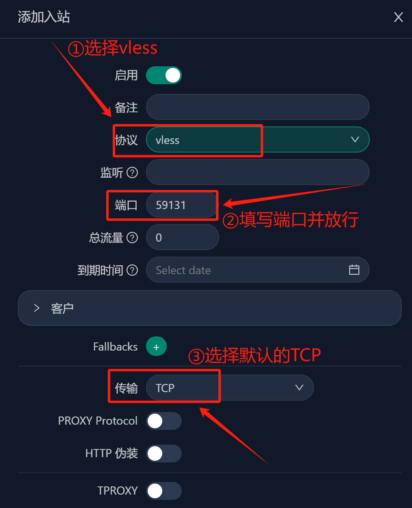

# 科学网

## X-UI

视频教程：▶https://youtu.be/1-TGGlkmJik

**✰〔3X-UI优化版〕跟原版3X-UI的区别？✰**

1. 1、最大限度地汉化了面板项目，更适合中文宝宝体质，包括：
   ①优化在VPS中进行〔脚本安装过程〕的汉化提示，增加相应的安装中文提示，让中文用户能明白清楚自己安装到了哪个环节？在细节方面，增加了安装成功之后的〔用户设置信息〕提示，在脚本中加入〔面板登录地址〕显示，
   ②管理后台进行了相应的〔图标和按钮〕汉化，让中文宝宝能够看得懂，
   ③安装成功后〔自动更改〕后台管理界面和电报机器人界面默认为〔中文〕，
   ④在管理后台中〔设置证书处〕，增加了acme方式填入路径的提示；
2. 2、优化了电报机器人响应〔按钮〕的名称和排序；
3. 3、创建了〔3X-UI〕中文交流群，各位中文宝宝可以一起讨论交流；
4. 4、管理后台中增加了〔实用导航〕页面，里面包含实用内容；
5. 5、优化了后台〔二维码〕显示模式，点击打开会更加丝滑美观；
6. 6、在创建reality协议时，更改uTLS指纹默认使用chrome；
7. 7、更新README内容添加备份&恢复操作说明，以及更多其他图文介绍；
8. 8、管理后台中增加〔端口检测〕和〔网络测速〕，点击可以跳转直达；
9. 9、增加了详细的项目〔安装配置教程〕，解决小白用户不懂配置的烦恼。系统状态监控

3X-UI 优化版开源项目地址:https://github.com/gm-cx/3x-ui-cn

**一、准备工作**
1、域名一个:推荐在 [Namesilo ](https://www.namesilo.com/?rid=fe81174he)进行购买（新用户1美元优惠券：kejixiaolu），因为他的 WHOIS 隐私 是免费的，可以适当的进行一下隐私保护，而且域名还都挺便宜的。（域名可以在 [Namesilo ](https://www.namesilo.com/?rid=fe81174he)解析，也可以将域名托管到 [Cloudflare ](https://dash.cloudflare.com/1fd6ef1f052a191089c7a5628aa6f5a7)，解析更快。）
检测服务器IP是否被封，确认IP可用。
已经解析的域名，Win+R 输入 CMD 回车：键入ping 空格输入你的域名，检查一下是否可以 ping 通。

2、一台境外 VPS 主流系统。 例如：Debian 12+ / Ubuntu 20.04+ / CentOS 8+

3、下载并安装 FinalShell SSH 工具
Windows、macOS、Linux 版下载地址：[点击进入下载](https://www.hostbuf.com/t/988.html)

**二、安装 3X-ui 面板**

**2.1、一键安装依赖包**

**更新及安装组件**。下面环境的安装方式，大家根据自己的系统选择命令安装就好了。
1、Debian/Ubuntu系统执行以下命令：

apt update -y && apt install -y curl && apt install -y socat

2、CentOS系统执行以下命令：

yum update -y && yum update -y && yum install -y socat

### **2.2、安装&升级**

### 【全新安装】请执行以下脚本：

bash <(curl -Ls https://raw.githubusercontent.com/xeefei/3x-ui/master/install.sh)

若要对版本进行升级，可直接通过脚本选择【2】，

在到这一步必须要注意：要保留旧设置的话，需要输入【n】


**2.3、****放行端口**
若你的VPS默认有防火墙，请在安装完成之后放行指定端口
1、放行【面板登录端口】
2、放行出入站管理协议端口
3、如果要申请安装证书并每3个月【自动续签】证书，请确保80和443端口是放行打开的
4、可通过此脚本的第【21】选项去安装防火墙进行管理，如下图：


PS：若要一次性放行多个端口或一整个段的端口，用英文逗号隔开。
若你的VPS没有防火墙，则所有端口都是能够ping通的，可自行选择是否进入脚本安装防火墙保证安全，但安装了防火墙必须放行相应端口。

**2.4、申请SSL证书**

3x-ui的管理面板：输入" x-ui " 然后回车，输入数字 “18” SSL 证书管理，接下来输入“1” 开始申请证书，如图：


接下来，按提示输入域名，把自己的域名托管到CF，并解析到自己VPS的IP，不要开启【小云朵】

**三、3X-ui 面板登录**

如果在安装过程中，全部都是默认【回车键】安装的话，用户名/密码/访问路径是随机的，而面板监听端口默认是2053，最好进入面板更改。登陆面板：在浏览器内输入“服务器IP:端口/路径”，进入登录页面


查看登录用户名、密码和面板路径，如下图：


在SSH输入“x-ui”，输入“10”查看面板设置。


面板设置：
1、已经安装证书的【路径】，位置在：/root/.acme.sh/（域名）_ecc；
2、进入后台【面板设置】—–>【常规】中，去分别填入刚才已经记录的证书公钥、私钥路径；
3、点击左上角的【保存】和【重启面板】，即可用自己域名进行登录管理。
4、再次登录面板：域名:端口/路径

PS：若你在正确完成了上述步骤之后，你没有安装证书的情况下，去用IP+端口号/路径的方式却不能访问面板，那请检查一下是不是你的浏览器自动默认开启了https模式，需要手动调整一下改成http方式，把“s”去掉，即可访问成功。

**四、创建【入站协议】**
1、点击左边【入站列表】，然后【添加入站】，传输方式保持【TCP】不变，尽量选择主流的vless+reality+vision协议组合，



在创建reality协议过程中，至于其他诸如：PROXY Protocol，HTTP 伪装，TPROXY，External Proxy等等选项，若无特殊要求，保持默认设置即可，不用去动它们，


其他：流量限制，到期时间，客户TG的ID等选项根据自己需求填写

PS：一定要放行端口之后，确保端口能够ping通，再导入软件。

节点配置及功能方面，请看 [视频教程](https://youtu.be/1-TGGlkmJik)

**五、关闭防火墙/放行端口**

关闭防火墙：

sudo ufw disable

放行端口 ：
例：如需放行80端口，代码：ufw allow 80

ufw allow 80

**六、各平台客户端**

v2rayNG【需要最新版本】
Windows（v2rayN）：https://github.com/2dust/v2rayN/releases/tag/6.23
Android（v2rayNG）：https://github.com/2dust/v2rayNG/releases/tag/1.8.5
IOS（shadowrocket)：https://apps.apple.com/app/shadowrocket/id932747118

**七、BBR 加速**

SSH 里面可以输入x-ui操作命令，输入“22” 启用 BBR ，根据提示再输入1，BBR就启用了


**验证 BBR 是否成功启用：**
执行以下命令，确认 BBR 已被启用：

sysctl net.ipv4.tcp_available_congestion_control

输出结果应包含 bbr，表示 BBR 已成功启用。

**八、如何保护自己的IP不被墙被封？**
1、使用的代理协议要安全，加密是必备，推荐使用vless+reality+vision协议组合，
2、因为有时节点会共享，在不同的地区，多个省份之间不要共同连接同一个IP，
3、连接同一个IP就算了，不要同一个端口，不要同IP+同端口到处漫游，要分开，
4、同一台VPS，不要在一天内一直大流量去下载东西使用，不要流量过高要切换，
5、创建【入站协议】的时候，尽量用【高位端口】，比如40000--65000之间的端口号。
提醒：为什么在特殊时期，比如：两会，春节等被封得最严重最惨？
尼玛同一个IP+同一个端口号，多个省份去漫游，跟开飞机场一样！不封你，封谁的IP和端口？
总结：不要多终端/多省份/多个朋友/共同使用同一个IP和端口号！使用3x-ui多创建几个【入站】，
多做几条备用，各用各的！各行其道才比较安全！GFW的思维模式是干掉机场，机场的特征个人用户不要去沾染，自然IP就保护好了。

 https://aoyi.pengfanao.top:8888/pWTC/

pfa    123456

## wrap+

### 第一步：下载 Cloudflare WARP

从 Cloudflare 官方网站下载 WARP 客户端：

- **官方网址**：1.1.1.1
- **注意**：请确保从官方渠道下载，避免使用不可信来源以确保安全。
- 在线生成密钥：https://ip125.com/warp/

### 第二步：安装并配置 WARP

安装 WARP 客户端后，需将其配置为使用 MASQUE 协议，以提高在中国网络环境下的兼容性。

1. 打开终端或命令提示符。
2. 设置 MASQUE 协议，运行以下命令：

 warp-cli tunnel protocol set MASQUE

### 第三步：设置优选端点

为了获得最佳性能，需为 WARP 配置以下经过测试的 IPv4 或 IPv6 端点。这些端点在中国使用 MASQUE 协议时目前可用。

##### IPv4 端点

162.159.198.2:443

162.159.198.2:500

162.159.198.2:1701

162.159.198.2:4500

162.159.198.2:4443

162.159.198.2:8443

162.159.198.2:8095

162.159.199.2:443

162.159.199.2:500

162.159.199.2:1701

162.159.199.2:4500

162.159.199.2:4443

162.159.199.2:8443

162.159.199.2:8095

##### IPv6 端点

[2606:4700:103::2]: 443
[2606:4700:103::2]: 500
[2606:4700:103::2]: 1701
[2606:4700:103::2]: 4500
[2606:4700:103::2]: 4443
[2606:4700:103::2]: 8443
[2606:4700:103::2]: 8095

设置端点的命令如下，将 `IP:PORT` 替换为你选择的端点：

IPv4 示例：

```plaintext
warp-cli tunnel endpoint set 162.159.199.2:1701
```

IPv6 示例：

```plaintext
warp-cli tunnel endpoint set [2606:4700:103::2]:443
```

验证协议是否设置成功，运行：

```plaintext
warp-cli statusCopy
```

### 第四步：使用优选工具自动设置端点

为了简化端点选择，你可以下载一款自动优选 MASQUE 端点的工具：

- **下载方式**：[网盘分享](https://mega.nz/folder/FrtCnTbK#2QrqYL9EbUs15J85ealXkw)
- **注意**：请验证网盘链接的来源是否可信，避免下载恶意软件。
- 使用该工具可以自动测试并选择最优端点，提升配置效率。

### 注意事项

- **定期检查端点**：网络环境可能变化，建议定期测试端点以确保连接稳定。
- **安全第一**：仅从官方或可信渠道下载软件和工具，防范潜在的安全风险。
- **反馈与更新**：如发现新的可用端点或工具更新，欢迎在评论区分享，共同优化使用体验。

通过以上步骤，你可以轻松配置 Cloudflare WARP，使用 MASQUE 协议和优选端点，享受更快速、稳定的网络连接！


## 节点池

allinurl: clash/proxies?c=

## 免费节点


## BPN

https://hansvlss.top/post/bpb/

PB Panel 是一个结合 Cloudflare Workers 和 Pages 的代理面板项目，可以帮助用户轻松搭建免费 VPN，实现永久免费节点订阅，为使用 singbox-core 和 xray-core 的跨平台客户端提供配置。

由于 Cloudflare 官方收紧对 BPB 等项目的审查，如果直接使用源码或者原作者提供的混淆代码，很容易出现 1101 的报错（可能代码中包含敏感关键词、或者使用了与他人相同的混淆代码）。

BPB官方更新Release v3.2.0版后，针对1101问题对整个项目已重构，以防止代码暴露并提高可维护性，而且之前非混淆文件已从版本中永久移除，所以原来的部署方法已失效，请重新按照下面教程重新部署。


### 一、准备工作

#### 1. **GitHub 账号**：通过 Github Action 自动同步最新 BPB 源代码。

#### 2. **Cloudflare 账号**：用于部署 BPB Panel 项目。

#### 3. **域名**：建议使用域名（解决 Cloudflare Pages 自带域名被墙的问题）。

### 二、Github 部署

#### 1. 新建 Github 仓库[](https://img.hansvlss.top/BPB/image-20250321070035293.png)

- 创建一个新的仓库，将 BPB Panel 项目代码同步到该仓库。

#### 2. 配置 Github Actions

[](https://img.hansvlss.top/BPB/image-20250424225135502.png)

- 在仓库根目录下创建 `.github/workflows` 文件夹，并在其中创建 `update-worker.yml` 文件。

```
plaintext
.github/workflows/update-worker.yml
```

- 将以下代码粘贴进去

```
name: Auto Update Worker

on:
  push:
    branches:
      - main
  schedule:
    - cron: "0 1 * * *" # 每天凌晨1点自动运行
  workflow_dispatch:     # 支持手动运行

permissions:
  contents: write

jobs:
  update:
    runs-on: ubuntu-latest
    steps:
      - name: 初始化仓库
        uses: actions/checkout@v4

      - name: 获取当前本地版本
        id: get_local_version
        run: |
          echo -e "\033[34m[获取本地版本]\033[0m"
          if [ -f version.txt ]; then
            LOCAL_VERSION=$(cat version.txt)
            echo "当前本地版本: $LOCAL_VERSION"
          else
            echo "首次同步，没有本地版本。"
            LOCAL_VERSION=""
          fi
          echo "LOCAL_VERSION=$LOCAL_VERSION" >> $GITHUB_ENV

      - name: 获取最新 Release 信息
        id: get_release
        run: |
          echo -e "\033[34m[获取最新 Release]\033[0m"
          API_URL="https://api.github.com/repos/bia-pain-bache/BPB-Worker-Panel/releases"
          RESPONSE=$(curl -s "$API_URL")
          LATEST_RELEASE=$(echo "$RESPONSE" | jq -r '.[0]')
          TAG_NAME=$(echo "$LATEST_RELEASE" | jq -r '.tag_name')
          DOWNLOAD_URL=$(echo "$LATEST_RELEASE" | jq -r '.assets[] | select(.name == "worker.zip") | .browser_download_url')

          if [ -z "$DOWNLOAD_URL" ] || [ "$DOWNLOAD_URL" == "null" ]; then
            echo -e "\033[31m未找到 worker.zip，退出！\033[0m"
            exit 1
          fi

          echo "最新版本号: $TAG_NAME"
          echo "DOWNLOAD_URL=$DOWNLOAD_URL" >> $GITHUB_ENV
          echo "TAG_NAME=$TAG_NAME" >> $GITHUB_ENV

      - name: 判断是否需要更新
        id: check_update
        run: |
          echo -e "\033[34m[判断是否需要更新]\033[0m"
          if [ "$LOCAL_VERSION" = "$TAG_NAME" ]; then
            echo -e "\033[32m已经是最新版本，无需更新。\033[0m"
            echo "UPDATE_NEEDED=false" >> $GITHUB_ENV
          else
            echo -e "\033[33m发现新版本，需要更新！\033[0m"
            echo "UPDATE_NEEDED=true" >> $GITHUB_ENV
          fi

      - name: 如果需要，清理旧文件并下载新版本
        if: env.UPDATE_NEEDED == 'true'
        run: |
          echo -e "\033[34m[清理旧文件]\033[0m"
          rm -rf ./*
          echo -e "\033[34m[下载最新 worker.zip]\033[0m"
          wget -O worker.zip "$DOWNLOAD_URL"
          echo -e "\033[34m[解压 worker.zip]\033[0m"
          unzip worker.zip
          echo -e "\033[34m[删除 worker.zip]\033[0m"
          rm worker.zip
          echo -e "\033[34m[记录新版本号]\033[0m"
          echo "$TAG_NAME" > version.txt

      - name: 提交更改
        if: env.UPDATE_NEEDED == 'true'
        uses: stefanzweifel/git-auto-commit-action@v5
        with:
          commit_message: "🔄 自动同步最新 Worker 版本：${{ env.TAG_NAME }}"
          commit_author: "github-actions[bot] <github-actions[bot]@users.noreply.github.com>"
          push_options: --force
```

#### 3. 执行 Github Actions

[](https://img.hansvlss.top/BPB/image-20250424225426428.png)

- GitHub 仓库通过`update-worker.yml` 会自动下载最新的 BPB 源代码
- `.last_version`：记录更新版本信息
- `_worker.js`：最新BPB 代码

### 三、Cloudflare 部署

#### 1. 登录 Cloudflare，创建 Pages 部署[](https://img.hansvlss.top/BPB/image-20250322100735664.png)

- 在 Cloudflare 控制台中进入 `Workers 和 Pages`，选择 `Pages `部署。

[](https://img.hansvlss.top/BPB/image-20250424225919394.png)

- 连接到你的 Github 仓库，选择刚才新建的 BPB 项目仓库，然后点击`开始部署`。

#### 2. 绑定自定义域名（可选）

[](https://img.hansvlss.top/BPB/image-20250424230057996.png)

- 在 Pages 项目的 `自定义域`选项卡，点击`设置自定义域`。

地址：

https://www.nslookup.io/domains/cdn.xn--b6gac.eu.org/dns-records/

#### 3. 设置变量[](https://img.hansvlss.top/BPB/image-20250322101207119.png)

部署成功后，在 Pages 项目界面点击 `设置` -> `变量和机密`，添加以下变量：

- **UUID**：使用 [UUID 生成器](https://1024tools.com/uuid) 随机生成一个新的 UUID。
- **PROXY_IP**：填写代理 IP 地址，可从 [随机代理 IP 站点](https://www.nslookup.io/domains/cdn.xn--b6gac.eu.org/dns-records/) 获取，或使用优选域名（例如 `cdn-b100.xn--b6gac.eu.org`）。
- **TR_PASS**：填写一个复杂字符串，作为密码。

#### 4. 绑定 KV 命名空间[](https://img.hansvlss.top/BPB/image-20250322103724074.png)

- **创建 KV**:点击左侧`存储和数据库`，再选择 `KV`,然后创建一个新的 KV 命名空间

  注:名称自定义但不能包含“bpb”[](https://img.hansvlss.top/BPB/image-20250322103833926.png)

- 绑定 KV:回到创建的 Pages 界面。点击 **设置** -> 【绑定】，点击**添加**，选择添加 KV 命名空间

  注:变量名称只能填写“kv”(小写)

#### 5. 重试部署 Pages

[](https://img.hansvlss.top/BPB/image-20250322103925749.png)

- 返回 Pages 项目,找到右侧“…”,点击重试部署

### 四、BPB 面板设置

#### 1. 验证部署是否成功

[](https://img.hansvlss.top/BPB/image-20250424230642265.png)

- 打开浏览器输入:https://[自定义域名]或者你的项目地址,后面加上`/panel`,检查是否能正常访问BPB面板

#### 2. 修改 BPB 面板密码

[](https://img.hansvlss.top/BPB/image-20250322104415048.png)

- 第一次打开 BPB 面板会提示修改密码,请设置一个复杂密码,避免被盗用

#### 3. 配置 BPB 面板参数

- 下面是BPB面板的参数解析，给大家做参考，请自行测试其效果。

🌐 **VLESS - Trojan**基础设置

| 项目                                                         | 说明              | 建议填写                                                     |
| ------------------------------------------------------------ | ----------------- | ------------------------------------------------------------ |
| Remote DNS                                                   | 远程 DNS 请求地址 | `https://8.8.8.8/dns-query`                                  |
| Local DNS                                                    | 本地 DNS 服务器   | `8.8.8.8`                                                    |
| Fake DNS                                                     | 虚假 DNS 功能     | `Enabled`                                                    |
| Proxy IPs / Domains 获取地址：[点击访问](https://www.nslookup.io/domains/cdn.xn--b6gac.eu.org/dns-records/) | 代理 IP/域名      | `141.147.156.68`、`cdn-xx-b6gac.acu.org`                     |
| Chain Proxy                                                  | 链式代理          | （空，默认）                                                 |
| Clean IPs / Domains                                          | 清洁 IP/域名      | `104.17.212.246`、`104.19.19.167`                            |
| Clean IP Scanner                                             | 下载扫描器按钮    | 点击 [Download Scanner](https://github.com/bia-pain-bache/Cloudflare-Clean-IP-Scanner/releases/tag/v2.2.5) |
| IPv6                                                         | 是否启用 IPv6     | `Enabled`                                                    |
| Custom CDN Addrs / Host / SNI                                | CDN 自定义字段    | 空                                                           |
| Best Interval                                                | 最佳间隔值        | `30`                                                         |
| Protocols                                                    | 协议选择          | `VLESS` 和 `Trojan` 都勾选                                   |
| TLS Ports                                                    | TLS 端口          | 勾选：443、8443、2053、2083、2087、2096                      |

#### ✂️ Fragment 分片设置

| 项目     | 说明         | 建议填写    |
| -------- | ------------ | ----------- |
| Length   | 分片长度范围 | `100 - 200` |
| Interval | 间隔时间范围 | `1 - 1`     |
| Packets  | 分片类型     | `tlsHello`  |

#### 🔄 Warp General 设置

| 项目          | 说明      | 建议填写                           |
| ------------- | --------- | ---------------------------------- |
| Endpoints     | Warp 端点 | `engage.cloudflareclient.com:2408` |
| Scan Endpoint | 脚本按钮  | 点击 “Copy Script”                 |
| Fake DNS      | 虚假 DNS  | `Disabled`                         |
| IPv6          | 启用 IPv6 | `Enabled`                          |
| Warp Configs  | 配置更新  | 点击 “Update”                      |
| Best Interval | 间隔设置  | `30`                               |

#### 🚀 Warp PRO 设置（各客户端）

#### 🌀 Hiddify / MahsaNG / NikaNG

| 项目         | 说明           | 建议填写  |
| ------------ | -------------- | --------- |
| Hiddify Mode | 模式选择       | `m4`      |
| NikaNG Mode  | 传输协议       | `quic`    |
| Noise Count  | 噪声包数量范围 | `10 - 15` |
| Noise Size   | 噪声包大小范围 | `5 - 10`  |
| Noise Delay  | 噪声延迟范围   | `1 - 1`   |

#### 🧩 Clash / Amnezia

| 项目        | 说明           | 建议填写   |
| ----------- | -------------- | ---------- |
| Noise Count | 噪声包数量     | `5`        |
| Noise Size  | 噪声包大小范围 | `50 - 100` |

#### 🔊 v2rayNG / v2rayN

| 项目         | 说明         | 建议填写   |
| ------------ | ------------ | ---------- |
| v2ray Mode   | 模式         | `Random`   |
| Noise Packet | 噪声包范围   | `50 - 100` |
| Noise Delay  | 延迟时间范围 | `1 - 1`    |
| Noise Count  | 噪声数量     | `5`        |

#### 🧭 Routing Rules 路由规则

#### 🟩 预设规则（Preset Rules）

| 类型   | 项目     | 勾选建议                                   |
| ------ | -------- | ------------------------------------------ |
| Bypass | 绕过区域 | ✅ LAN、Iran、Russia、ChatGPT（China 可选） |
| Block  | 阻止内容 | ✅ Ads、Porn（QUIC 可选）                   |

#### 🔧 自定义规则（Custom Rules）

| 项目                 | 说明               |
| -------------------- | ------------------ |
| Bypass IPs / Domains | 自定义绕过 IP/域名 |
| Block IPs / Domains  | 自定义阻止 IP/域名 |

- 全部设置好，点击 APPLY SETTINGS 保存 BPB 面板配置

### 五、VPN 节点部署完成

#### 1. 导出节点订阅链接

- 根据你所使用的代理软件，点击对应的 **COPY SUB** 按钮，复制 BPB 面板生成的订阅链接。

  #### 2. V2rayN 客户端导入节点订阅链接并使用

- 打开 V2rayN，进入【订阅分组】->【订阅分组设置】->【添加】,将订阅链接粘贴进去

- 点击【订阅分组】->【更新全部订阅(不通过代理)】，获取最新节点信息

- 测试节点延迟,确认节点有效后,开启系统代理,即可使用 VPN

现在 BPB 面板 VPN 部署全部结束,通过以上步骤,你可以利用 Cloudflare 和 BPB Panel 搭建一个永久免费 VPN,同时通过对 BPB 源代码进行加密混淆生成专属混淆代码,成功绕过 Cloudflare 的审查,解决 1101 报错问题,本期教程不仅支持 singbox-core 和 xray-core 等跨平台客户端等配置,还实现了永久免费节点订阅,满足大多数用户的使用需求,大家可以一起部署折腾,有什么问题,请在评论区留言,一起研究学习.


### 六、优选


结果:


https://bpn.pengfanao.top/login

WWrt123456@

教程：

- https://hansvlss.top/post/bpb/
- https://www.youtube.com/watch?v=HN95KEqO-ZE

https://www.youtube.com/watch?v=Ss9tAZagN7o&t=309s

## Google-IDE

1. 简单：https://github.com/byJoey/idx-free

2. 推荐：https://github.com/yonggekkk/ArgoSB

   cf:

   https://one.dash.cloudflare.com/9a920bf60e6005d249e673450b5a2191/networks/tunnels/add/cfd_tunnel

   gg-ide:

   https://studio.firebase.google.com/kx-55352304

   youtube:

   https://www.youtube.com/watch?v=0I5eI1KKx08

   ``` 
   nix=y uuid=0dcda753-86df-4f3f-887c-a49a5f18f7c1 vmpt=4545 agn=ggkx.pengfanao.top agk=eyJhIjoiOWE5MjBiZjYwZTYwMDVkMjQ5ZTY3MzQ1MGI1YTIxOTEiLCJ0IjoiYmFhZjJlNDgtNDgyMC00ZmNjLWExOWMtYmI3MjM5ODRjODAzIiwicyI6Ik1qRmxOamswT0RRdFptSmlZeTAwWkdSbUxXRXdaR1l0T1RReE1XUTBPV1JoT1RNeSJ9 bash <(curl -Ls https://raw.githubusercontent.com/yonggekkk/argosb/main/argosb.sh)
   ```

```
agsb del
```


