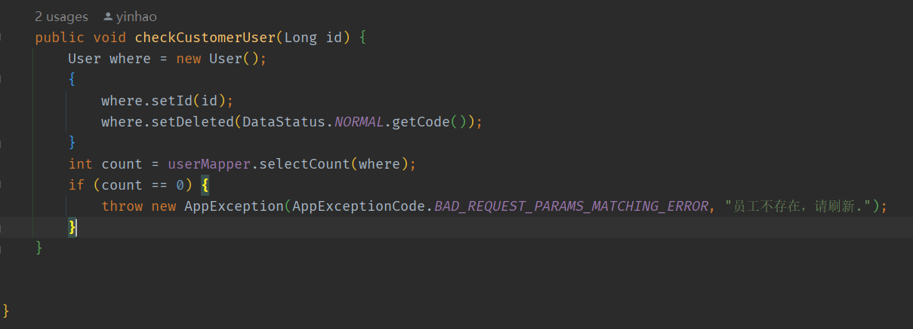

# 云平台2.0

## 1.1 list判断

```java
//  list=null   list=[]
if (paramData.getTagIdList() != null && paramData.getTagIdList().size() == 0) {
    paramData.setTagIdList(null);
}

```


problem:


---

### 1.1.2 检验id

等价于(user==null||DataStatus.valueof(whereUser.getDeleted)==DataStatus.Deleted)



----

## 1.2 统计7天30天

```sql

7天/30天参考：
SELECT
		date_add( curdate(), INTERVAL @i := @i - 1 DAY ) AS date
		FROM
		( SELECT 1
		<foreach item = "index" collection = "countList">
			UNION ALL SELECT 1
		</foreach > ) AS tmp,
		( SELECT @i := + 1 ) t


```


https://blog.csdn.net/XLX2339635744/article/details/116517811

-----

# 9月

## 1.1、Collections  与Collectors

---


## 1.2、统计30天和7天接口写死


---

## 1.3 choose

```sql
       <choose>
                <when test="isBefore">
                    AND create_time &lt; #{date}
                </when>
                <otherwise>
                    AND create_time &gt;= #{date}
                </otherwise>
            </choose>
```

## 1.4单个entry的Map

```
Collections.singletonMap("accountId", accountId)
```

## 1.5java中

```java
// |=（位或运算符）、&=（位与运算符）、^=（位异或运算）、~=（位非运算符
// 两个二进制对应位有一个1即为1(两个位置同时为0才为0) 位或
        int a1 = 5; // 0000 0101
        int b1 = 3; // 0000 0011
        a1 |= b1; // 0000 00111
        System.out.println("|= "+a1);


        // 两个二进制的对应位都为1时，结果为1，否则结果等于0  位与
        int a2 = 5; // 0000 0101
        int b2 = 3; // 0000 0011
        a2 &= b2; // 0000 0001
        System.out.println("&= "+a2);

        // 两个二进制的对应位相同，结果为0，否则结果为1   位异或
        int a3 = 5; // 0000 0101
        int b3 = 3; // 0000 0011
        a3 ^= b3; // 0000 0110
        System.out.println("^= "+a3);
```

---

## 1.6

1. 不配置首页权限,清除缓存登录admin还是404
1. 不同客户相同手机号

---

## 1.7 设备状态

设备有预置、待售、激活状态

只有待售状态才能在客户端添加设备激活

---

## 1.8MQTT流程


---

# 鼎一运营平台

1. Flowable
1. Camunda
1. kettle，datax，canal

## 1.1业务与流程解耦

- 不分配委派人，通过key和职能绑定一张表

## 1.2日志、业务、评论

flowable功能：


1、职能配置

2、模板解析

## 1.3迭代一开发

- 接口校验 api和svc
- 模板id为Long

## 1.4 迭代2开发

### 1.4.1与数据用fastjson,与前端用json

```java
// str-->objectlist   fastjson
JSON.parseArray(processTemplate.getUserTaskDetails(),
                            TaskDetail.class));

// objct-->str   fastjson
JSON.toJSONString(addProcessTemplateRequest.getTaskDetailsList()));
```

### 1.4.2 分页查询

```java
 @Override
    public List<SimpleTemplateResponse> listSimpleTemplate(TemplateTargetType targetType, Long targetId) {

        Template where = new Template();
        {
            where.setTargetType(targetType.getCode());
            where.setTargetId(targetId);
            where.setDeleted(DataStatus.NORMAL.getCode());
            where.setStatus(EnableStatus.ACTIVE.getCode());
        }

        Example templateExample = new Example(Template.class);
        templateExample.selectProperties("id", "name", "fileKey");
        templateExample.createCriteria().andEqualTo(where);
        List<Template> templateList = templateMapper.selectByExample(templateExample);
        if (templateList.isEmpty()) {
            return Collections.emptyList();
        }
        Set<String> fileKeySet = templateList.stream().map(Template::getFileKey).collect(Collectors.toSet());
        Example templateInfoExample = new Example(TemplateInfo.class);
        templateInfoExample.createCriteria()
                .andEqualTo("deleted", DataStatus.NORMAL.getCode())
                .andIn("fileKey", fileKeySet);

        Map<String, TemplateInfo> templateInfoMap = templateInfoMapper.selectByExample(templateInfoExample)
                .stream().collect(
                        Collectors.toMap(TemplateInfo::getFileKey, v -> v));

        TemplateInfo defaultTemplateInfo = new TemplateInfo();
        return templateList.stream().map(template -> {
            SimpleTemplateResponse simpleTemplateResponse = BeanUtil.copyProperties(template,
                    SimpleTemplateResponse.class);
            TemplateInfo templateInfo = templateInfoMap.getOrDefault(template.getFileKey(),
                    defaultTemplateInfo);
            simpleTemplateResponse.setPicture(templateInfo.getPreviewImageKey());
            simpleTemplateResponse.setParams(
                    JSON.parseArray(templateInfo.getVariableParams(), TemplateParamItem.class));
            return simpleTemplateResponse;
        }).collect(Collectors.toList());
    }
```

### 1.4.3io转字符串

```java
IoUtil.read(ossProvider.download(updateProcessTemplateRequest.getFileKey()).getContent(),
            StandardCharsets.UTF_8);
```

### 1.4.4 董事长审批

用职能分加金额判定解决

### 1.4.5 日志模块


### 1.4.6锁和唯一索引

```java
锁：
public void addActivation(ProductType productType, Long targetId, Long customerId, BooleanEnum activation) {

        RedisLock redisLock = redisLockConfig.getAddProductActivation();
        Map<String, Object> lockKeyParams = new HashMap<>();
        lockKeyParams.put("targetId", targetId);
        lockKeyParams.put("productType", productType.getCode());
        String key = redisLock.getKey(lockKeyParams);

        redisUtil.lockFunction(key, redisLock.getExpireTime(), redisLock.getWaitingTime(),
                redisLock.getTimeoutMessage(), () -> {

                    Activation where = new Activation();
                    {
                        where.setType(productType.getCode());
                        where.setTargetId(targetId);
                        where.setLatest(BooleanEnum.TRUE.getCode());
                    }
                    Activation params = new Activation();
                    {
                        params.setLatest(BooleanEnum.FALSE.getCode());
                    }
                    Example example = new Example(Activation.class);
                    example.createCriteria().andEqualTo(where);
                    activationMapper.updateByExampleSelective(params, example);

                    Activation addActivation = new Activation();
                    {
                        addActivation.setId(snowflake.nextId());
                        addActivation.setType(productType.getCode());
                        addActivation.setTargetId(targetId);
                        addActivation.setCustomerId(customerId);
                        addActivation.setActivation(BooleanEnum.TRUE.getCode());
                        addActivation.setLatest(BooleanEnum.TRUE.getCode());
                        addActivation.setCreateTime(globalContext.getRequestDate());
                        addActivation.setCreateBy(authentication.getCurrentUserId());
                    }
                    activationMapper.insert(addActivation);

                });

    }

索引：latest(时间戳)+type+targetId
```

### 1.4.7 @NotEmpty @NotNull @NotBlank

- **@NotBlank用于String类型**

  “The difference to {@code NotEmpty} is that trailingwhitespaces are getting ignored.” –> 和{@code NotEmpty}不同的是，尾部空格被忽略，也就是说，纯空格的String也是不符合规则的。所以才会说@NotBlank用于String，只能作用在String上，不能为null，而且调用trim()后，长度必须大于0。

- @NotEmpty的String类、Collection、Map、数组，是不能为null并且长度必须大于0的（String、Collection、Map的isEmpty()方法）。

- @NotNull 这个就很好理解了，不能为null，但可以为empty。

```java

// 全局处理字符串两端字符
@Configuration
public class GenGlobalCodeUtilsConfig {

    @Bean
    public Jackson2ObjectMapperBuilderCustomizer jackson2ObjectMapperBuilderCustomizer(){
        return new Jackson2ObjectMapperBuilderCustomizer() {
            @Override
            public void customize(Jackson2ObjectMapperBuilder jacksonObjectMapperBuilder) {
                jacksonObjectMapperBuilder.deserializerByType(String.class, new StdScalarDeserializer<String>(String.class) {
                    private static final long serialVersionUID = 1L;

                    @Override
                    public String deserialize(JsonParser jsonParser, DeserializationContext deserializationContext) throws IOException, JacksonException {
                        return StringUtils.trimAllWhitespace(jsonParser.getValueAsString());
                    }
                });
            }
        };
    }
}

```


### 1.4.8 流程回退

```java
// 1.一退一
runtimeService.createChangeActivityStateBuilder()
        .processInstanceId(proInstanceId)
        .moveActivityIdsToSingleActivityId(curTaskKeys, targetTaskKey)
        .changeState();

// 2.一退多
List<String > targetTaskKeys = new ArrayList<>();
targetTaskKeys.add("sid-CA74ADED-7E70-451D-951C-95988BFC3F07");
targetTaskKeys.add("sid-7922C598-74FD-4848-95AC-D9790AF68432");

runtimeService.createChangeActivityStateBuilder()
        .processInstanceId(proInstanceId)
        .moveSingleActivityIdToActivityIds("sid-CAD50E6F-7E0C-437D-816B-DDBA1A976A79", targetTaskKeys)
        .changeState();

// 3. 多退一
List<String > currentExecutionIds = new ArrayList<>();
List<Execution> executions = runtimeService.createExecutionQuery().parentId(proInstanceId).list();
for (Execution execution : executions) {
    System.out.println("并行网关节点数："+execution.getActivityId());
    currentExecutionIds.add(execution.getId());
}
runtimeService.createChangeActivityStateBuilder()
    	.processInstanceId(proInstanceId)
        .moveExecutionsToSingleActivityId(currentExecutionIds, targetTaskKey)
        .changeState();
// 4.子流程中退回到主干流程中某一个节点/主干流程退回到子流程中某一个节点。
```

### 1.4.9 审批

  审批就是推进一次，可以带map参数

### 1.4.10 aop

```java
@Aspect
@Component
public class StringTrimAop {

    // 定义切点方法 controller 包下，子孙包下所有类的所有方法
    @Pointcut("execution(* com.pfa.practice.controller.*.*(..))")
//    @Pointcut("@annotation(com.pfa.practice.annotations.StringTrim)") // 只能拦截方法 弃用
    public void pointcut() {
        System.out.println("切入点，并不会执行");
    }

    // 前置方法
    @Before("pointcut()")
    public void doBefore(JoinPoint joinPoint) throws Throwable {
        // 获取当前访问的class类及类名
        Class<?> tClass = joinPoint.getTarget().getClass();
        Validated validated = joinPoint.getTarget().getClass().getAnnotation(Validated.class);

        if (validated != null) {
            // 获取访问的方法名
            String methodName = joinPoint.getSignature().getName();
            System.out.println(methodName+"方法被捕获了");
            // 获取方法所有参数及其类型
            Object[] args = joinPoint.getArgs();
            Class[] argClz = ((MethodSignature) joinPoint.getSignature()).getParameterTypes();
            // 获取访问的方法对象
            Method method = tClass.getDeclaredMethod(methodName, argClz);

            Annotation[] declaredAnnotations = method.getDeclaredAnnotations();
        }
        System.out.println("这里执行前置方法逻辑");
    }

//    @Around("pointcut()")
//    public Object doAround(ProceedingJoinPoint proceedingJoinPoint) {
//        Object obj = null;
//        System.out.println("Around 方法开始执行");
//        try {
//            // 执行拦截方法
//            obj = proceedingJoinPoint.proceed();
//        } catch (Throwable throwable) {
//            throwable.printStackTrace();
//        }
//        System.out.println("Around 方法结束执行");
//        return obj;
//    }
}
```

### 1.4.11 获取类和方法注解

```java
// Class
Class.getAnnotations() 获取所有的注解，包括自己声明的以及继承的
Class.getAnnotation(Class< A > annotationClass) 获取指定的注解，该注解可以是自己声明的，也可以是继承的
Class.getDeclaredAnnotations() 获取自己声明的注解
// Method
Method.getAnnotations() 获取所有的注解，包括自己声明的以及继承的
Method.getAnnotation(Class< A > annotationClass) 获取指定的注解，该注解可以是自己声明的，也可以是继承的
Method.getDeclaredAnnotations() 获取自己声明的注解
```

### 1.4.12 setAccessible(**true**)

```java
public class Main {  
    public static void main(String[] args) throws Exception {  
        Class clazz = Class.forName("com.test.accessible.AccessibleTest");  
        AccessibleTest o = new AccessibleTest();  
        at.setId(1);  
        at.setName("AT");  
        for (Field field : clazz.getDeclaredFields()) {  
            field.setAccessible(true); //AccessibleTest类中的成员变量为private,故必须进行此操作  否侧抛出异常
            System.out.println(f.get(o)); //获取当前对象中当前Field的value  
        }  
  
    }  
 
}  
```

## 1.5迭代3开发

### 1.5.1流程撤回


### 1.5.2 接口调用

文件上传接口报错，后续接口仍出现调用

### 1.5.3 谁能看到立项后的项目

```java
1、s
SELECT
        p.* 
FROM
        `marketer_project` p
        INNER JOIN ( SELECT 1 dept_id, 80 weight UNION SELECT 2 dept_id, 0 weight ) w ON p.dept_id = w.dept_id 
        AND w.weight > 60
        
2、权重分

自动审批：
    流程提交人所有职能最高职能权重分 to 比较节点定义的最小职能权重分比较

数据隔离(立项、项目、推进）：
     用户所在部门和职能所在部门并包含其上级部门、下级部门的权重分数列表---》拼接sql
     // 立项
     SELECT
	process_form_project.*,
	process.`process_instance_id`,
	process.`status`,
	transactor.`name` AS transactor_name,
	leader.`name` AS leader_name,
	ops_dept.`name` AS dept_name ,
	w.*
FROM
	dyoms_component.`component_process_form_project` AS process_form_project
	LEFT JOIN dyoms_component.`component_process` AS process ON process_form_project.process_id = process.id
	LEFT JOIN dyoms_ops.`ops_user` AS transactor ON transactor.id = process_form_project.transactor
	LEFT JOIN dyoms_ops.`ops_user` AS leader ON leader.id = process_form_project.leader
	LEFT JOIN dyoms_ops.`ops_dept` AS ops_dept ON process_form_project.dept_id = ops_dept.id 
	INNER JOIN (SELECT 10 weight, 123 dept_id UNION SELECT 2 dept_id, 0 weight) w on w.dept_id=process_form_project.dept_id
WHERE
	process_form_project.deleted = 0 
ORDER BY
	process_form_project.create_time DESC 
	LIMIT 10
    // 测试值
        List<DeptWeightBo> deptWeightList = new ArrayList<>();
        DeptWeightBo deptWeightBo = new DeptWeightBo();
        deptWeightBo.setWeight(40);
        deptWeightBo.setId(1590584719522529282L);
        deptWeightList.add(deptWeightBo);

        DeptWeightBo deptWeightBo1 = new DeptWeightBo();
        deptWeightBo1.setWeight(60);
        deptWeightBo1.setId(15905847195225292L);
        deptWeightList.add(deptWeightBo1);

     
     
preview： 
     流程创建者、流程节点历史审批者、流程通知者、 当前节点职能id_list---》流程通知者
```

```java
// problem
1、立项修改参数校验
2、立项查询流程编号
3、审批  提交
4、保存长度校验
5、提交校验是否有流程

//
1、单个task 失败流程会怎么样 ----》 流程直接结束
2、不改变的流程每次都需要传吗-----》变量开始变量存放会存储，后面不改变会跟随流程

//
1、生成部门id----》根据迪米特法则，外面生成传进来
    
// 生成项目编号
    project.setBid(redisUtil.generateProjectBid(deptAgent.getSimpleNameByDeptId(addProjectRequest.getDeptId()).getDataThrow()))
    
//
1、流程实例id在监听时还没有存-----》callback回调

    
//
1、sql别名无法模糊
SELECT
    project.*,
    leader.`name` AS leader_name,
ops_dept.`name` AS dept_name 
FROM
	dyoms_marketer.`marketer_project` AS project
	LEFT JOIN dyoms_ops.`ops_user` AS leader ON project.leader = leader.id
	LEFT JOIN dyoms_ops.`ops_dept` AS ops_dept ON project.dept_id = ops_dept.id 
WHERE
	project.deleted = 0 
	AND `leader_name` LIKE "%张"
    
// problem:
1、项目成员----》负责人是否添加  能否删除项目负责人
```

### 1.5.4 handler

```java
    public <T> void apply(String key1,String key2,AuditDataRequest<T> auditDataRequest) {
        ProcessNodeFormHandler handler = null;
        
        if(key1 == "" && key2 == ""){
            ProjectPropelTaskNodeFormHandlerImpl handler1 = (ProjectPropelTaskNodeFormHandlerImpl) handler;
            
        }
        
    }
    
    //  强转
     if (Objects.equals(getProcessKey(auditDataRequest.getProcessId()).getKey(),
            ProcessEnum.PROJECT_APPROVAL.getKey())) {
            Boolean formData = (Boolean) auditDataRequest.getFormData();
        }


<select id="listProject" resultMap="ProjectBo">
    SELECT
    project.*,
    leader.`name` AS leader_name,
    ops_dept.`name` AS dept_name
    FROM
    dyoms_marketer.`marketer_project` AS project
    LEFT JOIN dyoms_ops.`ops_user` AS leader ON project.leader = leader.id
    LEFT JOIN dyoms_ops.`ops_dept` AS ops_dept ON project.dept_id = ops_dept.id
    WHERE
    project.deleted =0
    <if test="statusSet != null and statusSet.size() != 0">
      and project.status in
      <foreach close=")" collection="statusSet" item="statusId" open="(" separator=",">
        #{statusId}
      </foreach>
    </if>
    <if test="deptWeightList != null and deptWeightList.size !=0">
      INNER JOIN (
      <foreach collection="deptWeightList" item="deptWeight" separator="UNION">
        SELECT #{deptWeight.id} AS dept_id, #{deptWeight.weight} AS weight_score
      </foreach>
      ) weight
      ON weight.dept_id = process_form_project.dept_id
      AND weight.weight_score &gt; #{moduleScore}
      OR #{userId} IN ( SELECT user_id FROM dyoms_marketer.marketer_project_member  AS project_member WHERE dyoms_marketer.project_member.project_id = project.id AND project_member.deleted = 0 UNION SELECT leader AS user_id FROM dyoms_marketer.marketer_project WHERE dyoms_marketer.marketer_project.id=project.id)
    </if>
    <if test="pageProjectRequest.deptList != null and pageProjectRequest.deptList.size() != 0 ">
      and project.dept_id in
      <foreach close=")" collection="pageProjectRequest.deptList" item="deptId" open="(" separator=",">
        #{deptId}
      </foreach>
    </if>
    <if test="pageProjectRequest.leader != null and pageProjectRequest.leader != '' ">
      and leader.`name` like concat("%",#{pageProjectRequest.leader},"%")
    </if>
    <if test="pageProjectRequest.bid != null and pageProjectRequest.bid != '' ">
      and project.bid like concat("%",#{pageProjectRequest.bid},"%")
    </if>
    <if test="pageProjectRequest.name != null and pageProjectRequest.name != '' ">
      and project.name like concat("%",#{pageProjectRequest.name},"%")
    </if>
  </select>
```

### 1.5.4事务

```
// 流程驳回  flowable的事务和spring事务分离l
update(processNode.getProcessId(), null);
processApi.deleteProcessInstance(process.getProcessInstanceId(), "删除流程");
         
```

## 1.6迭代4开发

### 1.6.1批量插入

```java

//批量插入用import tk.mybatis.mapper.additional.insert.InsertListMapper;
import cn.com.hndyzy.oms.component.struct.model.po.ToDo;
import tk.mybatis.mapper.additional.insert.InsertListMapper;
import tk.mybatis.mapper.common.Mapper;

public interface ToDoMapper extends Mapper<ToDo>, InsertListMapper<ToDo> {

}
```

### 1.6.2职能-部门-用户

```java
有职能但不一定是这个部门的
    
// 难点
1、jie'di回滚
2、代办处理
3、
    
1、颜色hanlder
2、状态handler
3、监听handler
    
    
    
 @PutMapping("/test/add")
    public DataResult<?> add() {
        AddTodoProcessRequest addTodoProcessRequest = new AddTodoProcessRequest();
        {
            addTodoProcessRequest.setProcessId(1605038981882839040L);
            addTodoProcessRequest.setMattersToBeHandled("测试测试");
        }
        Long targetId = toDoProcessService.addToDoProcess(addTodoProcessRequest);

        AddToDoRequest addToDoRequest = new AddToDoRequest();
        {
            addToDoRequest.setTargetId(targetId);
            addToDoRequest.setTitle("项目立项");
            addToDoRequest.setType(ToDoType.PROCESS_TODO);
            addToDoRequest.setReceiverId(1586993790865375300L);
        }
        ArrayList<AddToDoRequest> list = new ArrayList<>();
        list.add(addToDoRequest);
        toDoService.add(list);
        return DataResult.success();
    }
```

### 1.6.3项目推进统计

以部门的人为中心导致一次推进累加到多个部门，由于一人可以在多个部门

### 1.6.4 生产环境bug

bean名字相同注入错误


## 1.7sp5开发

### 1.7.1windows强制删除文件夹

> rd /s/q dyoms-ops-struct

1.7.2 @RequestBody和@RquestParam


## 1.8项目升级（sp10）

mvn versions:set -DnewVersion=0.0.9-SNAPSHOT 

mvn clean install -U


- 代办模块表单渲染

- 后端定义一套组件并输出文档给前端

- 审批权限  统计数据分析职能


